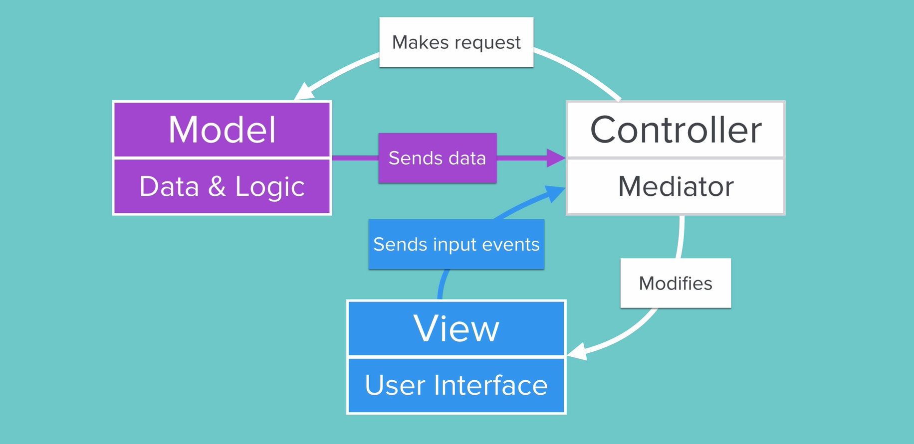

# DGM-Forensics

## Our Goal

The UVU Forensics Department would like to look into the possibility of Lidar technology being used to document a crime scene. Currently, 3d laser scanners are used for this purpose. These machines are very expensive and not always immediately available. First responders having an app that allows them to document a crime scene quickly and effectively could be a game-changer.

The Utah Valley University Forensics Department is in need of a more cost effective and overall efficient way of capturing a three-dimensional model of crime scenes. Currently, students have access to one MacBook Pro, one iPad Pro, one iPhone 12, and one iPhone 12 Pro Max. All mobile devices have the technology necessary for LiDar capture, and the MacBook Pro contains Xcode to develop LiDar applications with Swift UI. There currently exists a [prototype](https://www.figma.com/file/Bz728RX2a5lp9skQ6t4L7f/Forensics-App-Lidar_Jordan-Taylor_Spencer-Wright?node-id=0%3A1) built in Figma which contains a style guide, initial designs, wireframes, low-fidelity surface comps, and mid-fidelity surface comps/prototype. In addition to these assets, LiDar captures have been made on each of the mobile devices using three applications recommended by Continuum (3D Scanner App, Canvas, and Matterport).

# Important Notes

We will be implementing a MVC (Model View Controller) design pattern in our app.




# Constants

```
struct K {
    static let appName = "DGM Forensics"
    static let cellIdentifier = "ReusableCell"
    static let cellNibName = "MessageCell"
    static let loginSegue = "LoginToForensics"
    static let caseDetails = "CaseDetails"
    
    struct BrandColors {
        static let gold = "BrandGold"
    }
    
    struct FStore {
        static let collectionName = "cases"
        static let senderField = "sender"
        static let bodyField = "body"
        static let dateField = "date"
        static let id = "id"
    }
}

```


# Models


```
    struct CaseBrain {
        func getCase() -> { }
    }
```


```
struct ARBrain {
}

```


